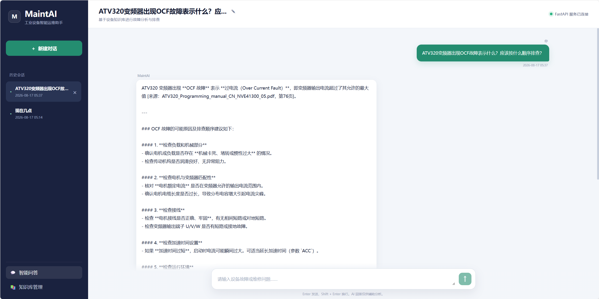
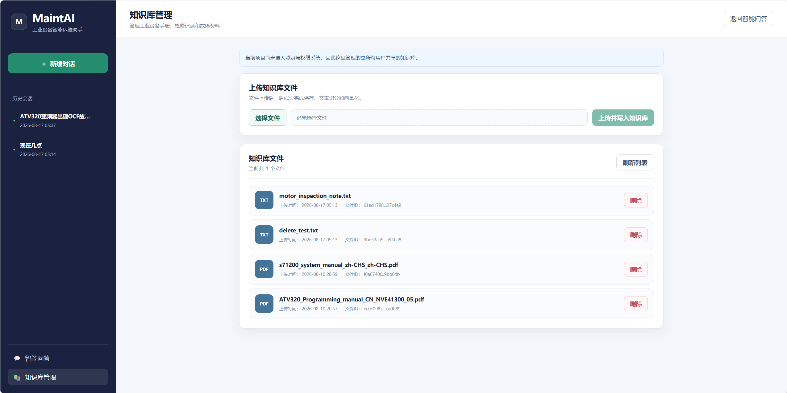
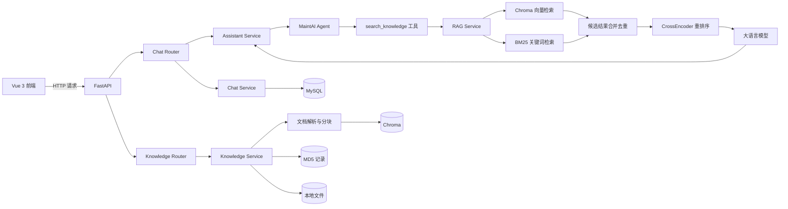
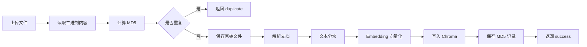
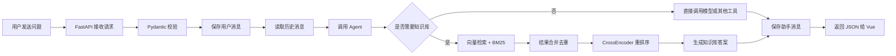

# MaintAI：工业设备智能运维 Agent

MaintAI 是一个面向工业设备故障诊断与运维知识问答场景的 AI Agent 应用。

项目将设备手册、巡检记录等资料构建为本地知识库，通过向量检索、BM25 关键词检索和 CrossEncoder 重排序获取相关内容，再由大语言模型生成具有知识库依据的故障分析与排查建议。

系统采用 FastAPI 提供后端接口，使用异步 SQLAlchemy 和 MySQL 持久化聊天记录，并通过 Vue 3 构建聊天与知识库管理页面。

> 当前版本定位为单用户学习与作品展示版本，暂未实现登录鉴权、多用户知识库隔离和流式输出。

## 项目演示

### 智能故障问答



### 知识库管理



## 已实现功能

### 智能问答

- 创建、查询、修改和删除聊天会话
- 保存用户消息和 AI 回复
- 加载历史消息，实现多轮对话
- Agent 根据问题自主选择知识库检索工具
- 支持时间查询等基础工具调用
- AI 回答持久化到 MySQL

### RAG 知识库

- 上传工业设备手册和巡检记录
- 根据文件 MD5 判断是否重复上传
- 文档解析、文本分块和向量化
- 使用 Chroma 保存向量数据
- 向量检索与 BM25 关键词检索
- 合并并去除重复候选文档
- 使用 CrossEncoder 对候选结果重新排序
- 提示词约束回答引用知识库文件与页码
- 查询、上传和删除知识库文件

### Web 接口与前端

- FastAPI RESTful API
- Swagger 自动接口文档
- Pydantic 请求校验与响应序列化
- 异步 SQLAlchemy 数据库访问
- Vue 3 + Vite 前端
- 聊天记录展示
- 历史会话切换
- 会话标题修改与删除
- 知识库文件上传、查看与删除
- CORS 前后端跨域配置

## 系统架构



## 离线知识库构建流程



## 在线问答流程



## 数据存储方式

系统没有把所有数据都存入 MySQL，不同类型的数据分别保存在适合的位置：

| 数据 | 保存位置 | 用途 |
|---|---|---|
| 用户、聊天会话、聊天消息 | MySQL | 保存结构化业务数据 |
| 原始知识库文件 | `storage/uploads/` | 保存 PDF、TXT 等原文件 |
| 文档向量 | Chroma 本地存储目录 | 语义检索 |
| 文件 MD5 与文件信息 | 本地 MD5 记录文件 | 重复文件判断和文件管理 |
| 运行日志 | `logs/` | 观察检索、Agent 和异常信息 |
| 配置与提示词 | `config/`、`prompts/` | 管理检索参数与提示词 |

## 技术栈

### 后端

- Python 3.13
- FastAPI
- Uvicorn
- Pydantic
- SQLAlchemy Async
- MySQL
- LangChain
- LangGraph Agent
- DashScope / OpenAI-compatible / Ollama
- Chroma
- BM25
- Sentence Transformers CrossEncoder

### 前端

- Vue 3
- Vite
- JavaScript
- Fetch API
- CSS

## 项目结构

```text
industrial-maintenance-agent
├── app
│   ├── agent                  # Agent、工具与中间件
│   ├── core                   # 配置、日志和路径工具
│   ├── database               # 数据库连接与 ORM 模型
│   ├── model                  # 聊天模型和嵌入模型工厂
│   ├── rag                    # 文档处理、混合检索和重排序
│   ├── routers                # FastAPI 子路由
│   ├── schemas                # Pydantic 请求与响应模型
│   ├── services               # 聊天、知识库和问答业务服务
│   └── main.py                # FastAPI 应用入口
├── config                     # YAML 等项目配置
├── data                       # 示例数据
├── frontend                   # Vue 3 前端项目
├── logs                       # 运行日志
├── prompts                    # Agent 与 RAG 提示词
├── storage
│   ├── uploads                # 上传的原始文件
│   └── ...                    # Chroma 与 MD5 等本地数据
├── tests                      # 测试代码
├── .env.example               # 环境变量示例
├── requirements.txt           # Python 依赖
└── README.md
```

## 快速开始

### 1. 克隆项目

```powershell
git clone <你的 GitHub 仓库地址>
Set-Location industrial-maintenance-agent
```

### 2. 创建并激活 Python 虚拟环境

```powershell
python -m venv .venv
Set-ExecutionPolicy -Scope Process -ExecutionPolicy RemoteSigned
.\.venv\Scripts\Activate.ps1
```

### 3. 安装后端依赖

```powershell
python -m pip install -r requirements.txt
```

### 4. 创建环境变量文件

```powershell
Copy-Item .env.example .env
```

打开 `.env`，填写自己的 MySQL 密码和模型 API Key。

请勿把真实 `.env` 上传到 GitHub。

### 5. 创建 MySQL 数据库

在 MySQL 中执行：

```sql
CREATE DATABASE maintai
CHARACTER SET utf8mb4
COLLATE utf8mb4_unicode_ci;
```

### 6. 初始化数据表

```powershell
python test_database.py
```

出现下面内容说明初始化成功：

```text
数据库表创建成功
```

### 7. 启动 FastAPI 后端

在项目根目录运行：

```powershell
python -m uvicorn app.main:app --reload
```

后端地址：

```text
http://127.0.0.1:8000
```

Swagger 接口文档：

```text
http://127.0.0.1:8000/docs
```

健康检查：

```text
http://127.0.0.1:8000/health
```

### 8. 启动 Vue 前端

新建一个终端，然后运行：

```powershell
Set-Location frontend
npm install
npm run dev
```

前端地址：

```text
http://127.0.0.1:5173
```

后端和前端需要同时保持运行。

## 环境变量说明

| 变量 | 说明 |
|---|---|
| `MYSQL_USER` | MySQL 用户名 |
| `MYSQL_PASSWORD` | MySQL 密码 |
| `MYSQL_HOST` | MySQL 地址 |
| `MYSQL_PORT` | MySQL 端口 |
| `MYSQL_DATABASE` | 数据库名称 |
| `LLM_TYPE` | 模型提供方，如 `ALIYUN`、`OPENAI`、`OLLAMA` |
| `ALIYUN_ACCESS_KEY_SECRET` | 阿里云 DashScope API Key |
| `CHAT_MODEL_NAME` | 对话模型名称 |
| `ALIYUN_EMBED_MODEL_NAME` | 阿里云 Embedding 模型 |
| `OPENAI_API_KEY` | OpenAI-compatible API Key |
| `OPENAI_BASE_URL` | OpenAI-compatible API 地址 |
| `OLLAMA_BASE_URL` | Ollama 服务地址 |

项目可以根据模型工厂配置切换不同的模型提供方式，实际使用时只需要配置当前选择的模型。

## API 接口

### 健康检查

| 方法 | 地址 | 说明 |
|---|---|---|
| GET | `/health` | 检查 FastAPI 服务 |
| GET | `/health/database` | 检查数据库连接 |

### 聊天会话

| 方法 | 地址 | 说明 |
|---|---|---|
| POST | `/api/chat/sessions` | 创建会话 |
| GET | `/api/chat/sessions` | 查询用户会话 |
| PATCH | `/api/chat/sessions/{session_id}` | 修改会话标题 |
| DELETE | `/api/chat/sessions/{session_id}` | 删除会话 |
| GET | `/api/chat/sessions/{session_id}/messages` | 查询历史消息 |
| POST | `/api/chat/sessions/{session_id}/messages` | 保存单条消息 |
| POST | `/api/chat/sessions/{session_id}/chat` | 调用 Agent 完成问答 |

### 知识库

| 方法 | 地址 | 说明 |
|---|---|---|
| POST | `/api/knowledge/upload` | 上传并处理知识库文件 |
| GET | `/api/knowledge/files` | 查询知识库文件 |
| DELETE | `/api/knowledge/files/{file_id}` | 删除知识库文件 |

## 项目亮点

1. 实现了从文件上传、解析、分块、向量化到在线问答的完整 RAG 链路。
2. 将向量检索与 BM25 关键词检索结合，提高工业型号和故障代码的召回能力。
3. 使用 CrossEncoder 对候选文档重新排序，提高最终上下文相关性。
4. 使用 MD5 实现重复文件检测，避免相同知识重复入库。
5. 通过 LangGraph Agent 统一调度知识库检索和基础工具。
6. 使用异步 SQLAlchemy 与 MySQL 保存会话和消息，实现聊天历史持久化。
7. 使用 FastAPI 和 Vue 完成前后端分离，并提供 Swagger 接口文档。
8. 提供知识库文件的上传、查看和删除功能，形成完整的知识库管理流程。

## 当前版本说明

当前版本主要用于学习、作品展示和实习求职，已经完成核心业务闭环，但仍有以下限制：

- 前端暂时固定使用 `user_id=1`
- 暂未实现用户注册、登录和 JWT 鉴权
- 知识库为全局知识库，暂未实现用户级数据隔离
- Agent 回答暂未实现流式输出
- 知识库删除接口暂未增加管理员权限判断
- 当前主要验证了 PDF 和 TXT 文档
- 暂未完成 Docker 部署和自动化测试

## 后续计划

- 增加用户注册、登录和 JWT 鉴权
- 增加管理员与普通用户角色
- 实现知识库权限控制
- 实现 SSE 流式回答
- 增加结构化引用来源和页码
- 增加 pytest 自动化接口测试
- 使用 Docker Compose 部署 FastAPI、Vue 和 MySQL
- 增加设备故障工单和维修记录管理